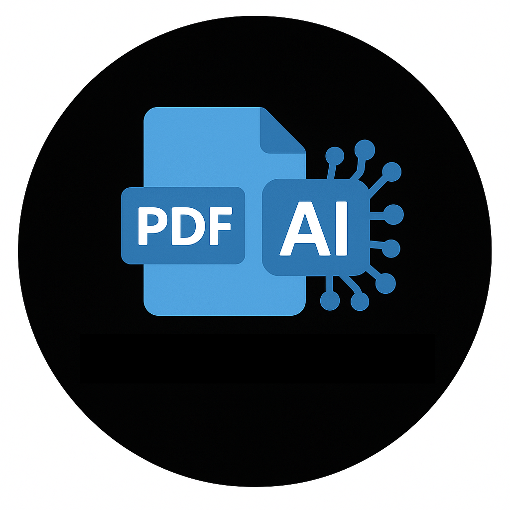

# PDF Explainer

An Electron desktop app for reading academic papers (PDF) with an AI assistant built in. It
explains passages and equations in context, lets you chat about a marked-up region or about
the whole document, and saves the results as real annotations inside the PDF file itself —
so the notes are still there next time you (or anyone else) open it in any PDF viewer.

<p align="left">
  
</p>

## What it does

- **Read PDFs** — open a file, page through it, zoom, jump to a page, and pick up recently
  opened documents from a list.
- **Explain a marked passage** — select text, or drag a box over an equation, figure or table
  ("Mark region"), and ask the AI to explain it. The AI always has the full text of the paper
  as context, so it can explain a passage in terms of the paper's own notation and earlier
  definitions rather than generically.
- **Ask about the whole document** — a separate chat panel (left side of the window) that isn't
  tied to any specific passage: ask free-form questions about the paper as a whole, with the
  full document text sent as context every time.
- **Save answers as real PDF annotations** — "Save as note" writes the AI's answer into the PDF
  as a proper Highlight/Square annotation with a linked popup comment, so it shows up in the
  Notes column while reading and persists in the file itself. A document-wide chat's note is
  saved as a small marker near the bottom of the last page instead, since it isn't tied to a
  highlighted passage.
- **Abstract** — for a longer back-and-forth discussion, "Abstract" asks the AI to condense the
  whole conversation into a short, reviewable summary you can edit before saving, instead of
  saving the raw last reply (or the entire transcript).
- **Rendered replies** — AI responses are rendered as formatted markdown, including LaTeX math
  (`$...$` / `$$...$$`) typeset with KaTeX, instead of raw source text.
- **Any OpenRouter model** — bring your own OpenRouter API key and pick any model from the live
  catalog (with autocomplete and a "recently used" list), including a check for whether it
  supports image input (needed for "Mark region") and prompt caching (keeps a long reading
  session affordable, since the whole paper is resent as context on every call).

## How to use it

### 1. Install and run

```bash
git clone <this repository>
cd pdf_explainer

npm install
npm run build   # bundles the renderer (React UI) into dist/
npm start       # launches the Electron app
```

`npm run dev` runs webpack in watch mode if you're changing the renderer UI — run `npm start`
in a separate terminal to launch the app against whatever's currently built.

### 2. Set up your OpenRouter key

Click the settings button in the header, paste an API key from
[openrouter.ai/keys](https://openrouter.ai/keys), and pick a model (start typing to search the
catalog, or reuse a recently-used one). Green badges show whether the selected model supports
image input and prompt caching.

### 3. Read and ask

- Open a PDF from the landing screen.
- **Select some text**, or use **"Mark region"** to drag a box over an equation/figure, then
  click through to open the explain panel. Edit the pre-filled prompt if you like, then send it.
- Ask follow-up questions in the same panel — the AI sees the whole conversation each time.
- Click **"Save as note"** to write the current answer into the PDF, or **"Abstract"** to get a
  short, editable summary of the whole discussion to save instead.
- Click **"Ask about document"** in the header to open the whole-document chat on the left side
  and ask questions that aren't tied to any specific passage.
- Saved notes show up in the **Notes column** next to the page they're attached to.

## Building blocks

- **[Electron](https://www.electronjs.org/)** — the desktop shell. The main process
  (`src/main`) owns the filesystem, reads/writes PDF annotations, and talks to OpenRouter; the
  renderer process (`src/renderer`) is a sandboxed Chromium window with `nodeIntegration`
  disabled, talking to the main process only through a `contextBridge` preload script
  (`src/main/preload.js`) — never directly.
- **[React](https://react.dev/) + [Redux Toolkit](https://redux-toolkit.js.org/)** — the
  renderer UI and its state (recent documents, user preferences, model capabilities).
- **[pdfjs-dist](https://mozilla.github.io/pdf.js/)** — renders PDF pages to canvas and extracts
  the text layer (both the visible text and the full document text used as AI context).
- **[pdf-lib](https://pdf-lib.js.org/)** — reads and writes real PDF annotation objects
  (Highlight/Square + Popup) at a low level, so saved notes are genuine PDF annotations rather
  than something proprietary to this app.
- **[openai](https://www.npmjs.com/package/openai) SDK → OpenRouter** — the official OpenAI SDK
  is used purely as an HTTP client, pointed at OpenRouter's OpenAI-compatible API, so any model
  OpenRouter offers can be used with one client. Streaming is used for the chat panels; a
  one-shot (non-streaming) call is used for "Abstract".
- **[react-markdown](https://github.com/remarkjs/react-markdown) + remark-math + rehype-katex +
  [KaTeX](https://katex.org/)** — renders the AI's markdown and LaTeX math output in the chat
  panels.
- **[electron-store](https://github.com/sindresorhus/electron-store)** — persists settings (API
  key, selected model, recently-used models) and the recent-documents list locally.
- **[Webpack](https://webpack.js.org/) + Babel** — bundles the React/JSX renderer code into the
  single script Electron loads (`target: 'web'`, since the renderer never uses Node APIs
  directly — everything goes through the preload bridge).
- **[electron-builder](https://www.electron.build/)** — packages the app for Windows, macOS and
  Linux (`npm run dist`).

## License

MIT — see [LICENSE](LICENSE).
